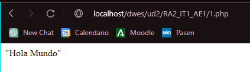
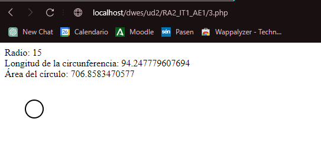
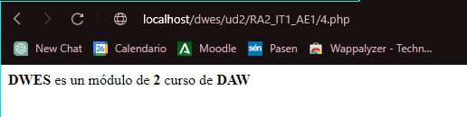
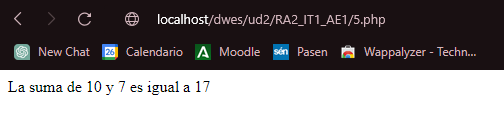
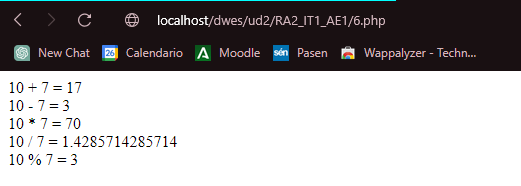
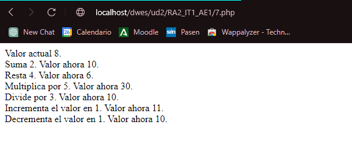
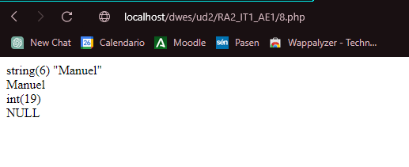
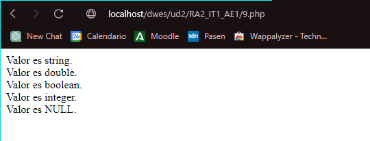
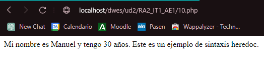

# RA2_IT1_AE1
**Manuel David Ayala Reina**
## Actividades evaluables.
1. Script que muestre el mensaje Hola Mundo entrecomillado.

```php

<?php 
/**
* @author Manuel David Ayala Reina
* @package dwes_php
* @subpackage dwes_unidad2
* @category Actividades evaluables.
* @version 1.0
*/
echo "\"Hola Mundo\""
?>
```


2. Ficha personal con los datos cargados en variables. El resultado debe mostrar una foto personal.
```php
<?php
/**
* @author Manuel David Ayala Reina
* @package dwes_php
* @subpackage dwes_unidad2
* @category Actividades evaluables.
* @version 1.0
*/
$nombre = "Manuel David Ayala Reina";
$edad = 19;
$ciudad = "Córdoba";
$profesion = "Desarrollador Web";
$foto = "Fotos/FotoPersonal.jpg";

echo "<h1>Ficha Personal</h1>";
echo "<p>Nombre: $nombre</p>";
echo "<p>Edad: $edad años</p>";
echo "<p>Ciudad: $ciudad</p>";
echo "<p>Profesión: $profesion</p>";
echo "";
?>
```


3. Script que, a partir del radio almacenado en una variable y la definición de la constante PI, calcule el área del círculo y la longitud de la circunferencia. El debe mostrar valor de radio, longitud de la circunferencia, área del círculo y dibujará un círculo utilizando gráficos vectoriales.

```php
<?php
/**
* @author Manuel David Ayala Reina
* @package dwes_php
* @subpackage dwes_unidad2
* @category Actividades evaluables.
* @version 1.0
*/
$radio = 5;
$pi = M_PI;

$longitudCircunferencia = 2 * $pi * $radio;
$areaCirculo = $pi * pow($radio, 2);

echo "Radio: $radio<br>";
echo "Longitud de la circunferencia: $longitudCircunferencia<br>";
echo "Área del círculo: $areaCirculo<br>";

echo "<svg width='100' height='100'><circle cx='50' cy='50' r='$radio' stroke='black' stroke-width='2' fill='transparent' /></svg>";
?>
```


4. ¿Cuál es la salida del siguiente script?
```php
<?php
/**
* @author Manuel David Ayala Reina
* @package dwes_php
* @subpackage dwes_unidad2
* @category Actividades evaluables.
* @version 1.0
*/
$ciclo = "DAW";
$modulo = "DWES";
print "<p>";
printf("<strong>%s</strong> es un módulo de <strong>%d</strong> curso de <strong>%s</strong>", $modulo, 2, $ciclo);
print "</p>";
?>
```

Lo que hace es poner en negrita las variables.

5. Script que escriba el resultado de la suma de dos números almacenados en dos variables.
```php
<?php
/**
* @author Manuel David Ayala Reina
* @package dwes_php
* @subpackage dwes_unidad2
* @category Actividades evaluables.
* @version 1.0
*/
$num1 = 10;
$num2 = 7;
$suma = $num1 + $num2;
echo "La suma de $num1 y $num2 es igual a $suma";
?>
```



6. Script que realiza operaciones matemáticas con variables:
$x=10;
$y=7;
y muestre
10 + 7 = 17
10 - 7 = 3
10 * 7 = 70
10 / 7 = 1.4285714285714
10 % 7 = 3
```php
<?php
/**
* @author Manuel David Ayala Reina
* @package dwes_php
* @subpackage dwes_unidad2
* @category Actividades evaluables.
* @version 1.0
*/
$x = 10;
$y = 7;

$suma = $x + $y;
$resta = $x - $y;
$multiplicacion = $x * $y;
$division = $x / $y;
$modulo = $x % $y;

echo "$x + $y = $suma<br>";
echo "$x - $y = $resta<br>";
echo "$x * $y = $multiplicacion<br>";
echo "$x / $y = $division<br>";
echo "$x % $y = $modulo<br>";
?>
```



7. Escribir un script que declare una variable y muestre la siguiente información en pantalla:
Valor actual 8.
Suma 2. Valor ahora 10.
Resta 4. Valor ahora 6.
Multipica por 5. Valor ahora 30.
Divide por 3. Valor ahora 10.
Incrementa el valor en 1. Valor ahora 11.
Decrementa el valor en 1. Valor ahora 11.
```php
<?php
/**
* @author Manuel David Ayala Reina
* @package dwes_php
* @subpackage dwes_unidad2
* @category Actividades evaluables.
* @version 1.0
*/
$valor = 8;
echo "Valor actual $valor.<br>";
$valor += 2;
echo "Suma 2. Valor ahora $valor.<br>";
$valor -= 4;
echo "Resta 4. Valor ahora $valor.<br>";
$valor *= 5;
echo "Multiplica por 5. Valor ahora $valor.<br>";
$valor /= 3;
echo "Divide por 3. Valor ahora $valor.<br>";
$valor++;
echo "Incrementa el valor en 1. Valor ahora $valor.<br>";
$valor--;
echo "Decrementa el valor en 1. Valor ahora $valor.<br>";
?>
```


8. A veces es necesario conocer exactamente el contenido de una variable. Piensa como puedes hacer esto y escribe un script con la siguiente salida:
string(5) “Harry”
Harry
int(28)
NULL
```php
<?php
/**
* @author Manuel David Ayala Reina
* @package dwes_php
* @subpackage dwes_unidad2
* @category Actividades evaluables.
* @version 1.0
*/
$nombre = "Manuel";
$edad = 19;
$nulo = NULL;

var_dump($nombre);
echo "<br>";
echo $nombre;
echo "<br>";
var_dump($edad);
echo "<br>";
var_dump($nulo);
?>
```


9. Escribir un script que utilizando variables permita obtener el siguiente resultado:
Valor es string.
Valor es double.
Valor es boolean.
Valor es integer.
Valor is NULL.
```php
<?php
/**
* @author Manuel David Ayala Reina
* @package dwes_php
* @subpackage dwes_unidad2
* @category Actividades evaluables.
* @version 1.0
*/
$valor1 = "string";
$valor2 = 3.14;
$valor3 = true;
$valor4 = 42;
$valor5 = NULL;

echo "Valor es " . gettype($valor1) . ".<br>";
echo "Valor es " . gettype($valor2) . ".<br>";
echo "Valor es " . gettype($valor3) . ".<br>";
echo "Valor es " . gettype($valor4) . ".<br>";
echo "Valor es " . gettype($valor5) . ".<br>";
?>
```



10. Pon ejemplo de uso de la sintaxis heredoc en el manejo de cadenas.
```php
<?php
/**
* @author Manuel David Ayala Reina
* @package dwes_php
* @subpackage dwes_unidad2
* @category Actividades evaluables.
* @version 1.0
*/
$nombre = "Manuel";
$edad = 30;

$informacion = <<<INFO
Mi nombre es $nombre y tengo $edad años.
Este es un ejemplo de sintaxis heredoc.
INFO;

echo $informacion;
?>
```


